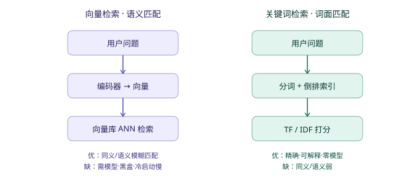

# 检索方案对比：向量检索 vs 关键词检索（ES）

> 本文档整理自项目讨论，用于说明"向量检索"与"关键词检索（ES / BM25）"的本质区别、
> 各自利弊，以及本项目为何选择手搓关键词检索而非上向量或 ES。

## 一句话本质区别

- **向量检索**：比的是"意思像不像"——文本转成向量，按余弦相似度找近邻。
- **关键词检索**：比的是"词面重不重合"——倒排索引 + 词频/IDF（BM25）打分。

---

## 一、对比总表

| 维度 | 向量检索（语义） | 关键词检索（ES / BM25） |
|---|---|---|
| **匹配原理** | 文本 → 向量，按余弦相似度找近邻 | 倒排索引 + 词频/IDF（BM25）打分 |
| **同义/改写** | 天然支持（"收入" ≈ "营收" 能匹配） | 弱，要靠**预置同义词表**才够 |
| **精确性** | 模糊，"近似"就可能误召回 | 精确，词面命中可控、可解释 |
| **可解释性** | 黑盒，难说清"为什么召回这条" | 白盒，命中词/得分都能追 |
| **基础设施** | 需 embedding 模型 + 向量库（Milvus 等） | ES 是独立服务，要部署维护 |
| **冷启动/成本** | 模型加载慢、占算力 | 几乎零成本，纯计算 |
| **大规模语料** | 擅长（百万级文档语义检索） | 擅长（ES 本就是为此设计） |
| **小语料（如元数据）** | 杀鸡用牛刀，收益不明显 | 轻松胜任，且更稳 |

---

## 二、关于 "ES 关键词检索"

ES（Elasticsearch）= 一个**现成的、工业级的关键词检索引擎**（底层 Lucene 倒排索引）。
它的关键词模式就是货真价实的 **Okapi BM25** 打分 + 分词器 + **同义词过滤器** + 模糊匹配，
开箱即用、能扛海量数据。但代价是：你得**单独跑一个 ES 服务**、建索引、做运维。

因此 "ES 关键词检索" 与本项目手搓的关键词检索是 **同一思路、不同实现层次**——
本项目相当于用几十行 Python 手搓了一个"迷你 BM25 + 同义词"，省掉了跑 ES 的成本。

---

## 三、本项目为什么两者都没用，而是手搓关键词？

作者在 `backend/app/utils/text.py` 文件头写明了取舍，逻辑成立：

1. **语料极小**：只有几十张表、上百字段。这种量级上，向量模型的"语义泛化"几乎派不上用场，
   反而引入模型 + 向量库的复杂度。
2. **要可解释、可单测**：问数系统召回错了 LLM 就会写错 SQL。关键词打分每一步都能追
   （命中了哪个词、得了几分），调试友好。
3. **同义服用了"人工元数据"解决**：`ColumnInfo.synonyms` / `MetricInfo.aliases` 等字段
   把同义词直接配进文档（见 `retrieval.py` 的 `_doc_text`），等于用"人工维护的小同义词表"
   替代了"embedding 模型的自动泛化"——成本低、可控。
4. **关键一击：取值字典必须精确**。`recall_values`（`retrieval.py`）要的是**精确枚举值**
   （"上海代表处"必须原样匹配，不能"语义相似"出个"上海分公司"）。这一点上，向量检索的
   "模糊"反而是劣势，精确的关键词/字典匹配才是正解。

---

## 四、什么时候该升级？

- **上 ES**：当元数据/文档量级变大、或你懒得手维护同义词、想要现成的分词/BM25/模糊搜索
  全家桶时。本质是把"手搓 BM25"换成"工业 BM25"，思路不变。
- **上向量**：只有当出现大量**未登记同义、口语化、表述多样**的问法，且手维护同义词跟不
  上时。更优解是**混合检索**（向量召回候选 + 关键词/规则保精确），这也是现在的业界主流。

---

## 五、给初学者的实践建议

1. 先吃透现在这套手搓关键词检索（已摸清 `retrieval.py` + `text.py`），它是最好的 "BM25 入门教材"。
2. 想体会真正的 BM25，不必上 ES——可装 `rank_bm25` 库，把项目里的 `_match_score` 换成它，
   几行代码即可对比效果。
3. 向量检索建议放后面学：先理解 embedding 是什么、余弦相似度怎么算，再去看 Milvus / pgvector。
   在此之前，别被"现在都上向量了"带节奏——**检索选型看数据规模和可解释性要求，不是越新越好**。

---

## 结论

向量赢在"语义/泛化"，关键词赢在"精确/可控/便宜"。问数（text2sql）场景恰恰最吃
"精确 + 可解释"，所以手搓关键词是当下最划算的选择。
